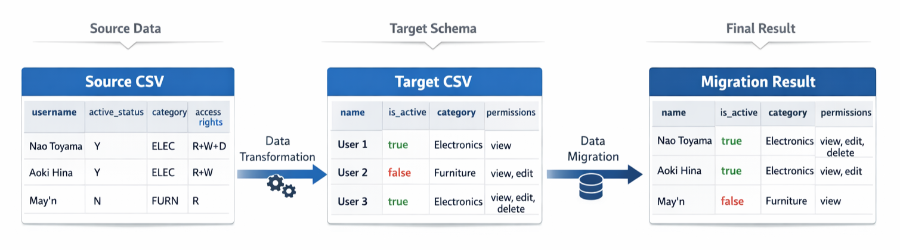

# CSV Migration Tools

CSV Migration Tools for automatically generating CSV data migration schemas. This tool analyzes source and target CSV formats, then uses AI to intelligently map columns and values between different data structures.



## Background: The CSV Migration Problem

Data migration projects often involve transforming CSV files from one format to another. A typical scenario involves a CSV file with hundreds or thousands of rows that needs to be converted to match a completely different structure. Column names don't match, boolean values use different representations (`Y/N` vs `true/false`), categorical codes require mapping (`ELEC` → `Electronics`), and complex grouped values present additional challenges (`R+W+D` → `view, edit, delete`).

This problem is particularly common for businesses using Point of Sale (POS) or inventory management applications. When switching from one application to another, the exported data from the current system rarely matches the import format required by the new system.

For example, a retail store migrating from an older POS system to a modern cloud-based solution might export product data where status values are coded as "A" (active), "D" (discontinued), or "L" (low stock). The new system, however, expects full text values like "in_stock", "discontinued", and "low_stock". Similarly, the old system might use category codes like "ELEC", "FURN", or "FOOD", while the new system requires complete category names like "Electronics", "Furniture", or "Food & Beverage".

The challenge multiplies when dealing with hundreds or thousands of product records, multiple enum fields requiring transformation, and complex grouped values such as permissions or access rights. Manual conversion becomes impractical, error-prone, and time-consuming.

The traditional approach requires manually comparing both CSVs, creating a mapping document, writing transformation code, testing, debugging, and repeating the process. For a 50-column CSV with dozens of enum mappings, this process can take hours or even days.

This project was created to address these challenges through a structured, automated approach, specifically targeting scenarios where businesses need to migrate data between different software systems.

## Method 1: Manual Schema Creation

The initial solution involved creating a structured JSON schema format that explicitly defines how to map data between formats. This approach establishes a clear contract for data transformation.

### Target Schema 

Example Target CSV:
| name   | is_active | category     | permissions        |
|--------|-----------|--------------|--------------------|
| User 1 | true      | Electronics  | view               |
| User 2 | false     | Furniture    | view, edit         |
| User 3 | true      | Electronics  | view, edit, delete |

Defines the destination structure:

```json
[
  {
    "column": "name",
    "values": []
  },
  {
    "column": "is_active",
    "values": ["true", "false"]
  },
  {
    "column": "category",
    "values": ["Electronics", "Furniture"]
  },
  {
    "column": "permissions",
    "values": ["view", "view, edit", "view, edit, delete"]
  }
]
```

- `column` - The CSV column name (from CSV headers)
- `values` - Array of all possible categorical values for this column. Populated only if:
  - The column contains a limited, fixed set of values (enum, category, status, boolean)
  - The column has no relational dependency on other columns (not a foreign key or related name field)
  - Set to empty array `[]` if the column contains dynamic values (IDs, names, numbers, dates, free text)

### Source Schema

Example Source CSV:
| username   | active_status | category | access_rights |
|------------|---------------|----------|---------------|
| Nao Toyama | Y             | ELEC     | R+W+D         |
| Aoki Hina  | Y             | ELEC     | R+W           |
| May'n      | N             | FURN     | R             |

Maps source to target with transformations:

```json
[
  {
    "column": "username",
    "target_column": "name",
    "values": []
  },
  {
    "column": "active_status",
    "target_column": "is_active",
    "values": ["Y", "N"],
    "values_mapping": {
      "Y": "true",
      "N": "false"
    }
  },
  {
    "column": "category",
    "target_column": "category",
    "values": ["ELEC", "FURN"],
    "values_mapping": {
      "ELEC": "Electronics",
      "FURN": "Furniture"
    }
  },
  {
    "column": "access_rights",
    "target_column": "permissions",
    "values": ["R", "R+W", "R+W+D"],
    "values_mapping": {
      "R": "view",
      "R+W": "view, edit",
      "R+W+D": "view, edit, delete"
    }
  }
]
```

- `column` - The source CSV column name (header)
- `target_column` - The target schema column name that `column` maps to
- `values` - Array of all possible categorical values for this column. Populated only if:
  - The column contains a limited, fixed set of values (enum, category, status, boolean)
  - The column has no relational dependency on other columns (not a foreign key or related name field)
  - Set to empty array `[]` if the column contains dynamic values (IDs, names, numbers, dates, free text)
- `values_mapping` - Object that maps source CSV values to target schema values. Populated only when:
  - BOTH source `values` AND target `values` are non-empty (both are categorical)
  - Maps each source categorical value to its corresponding target categorical value
  - Set to `null` if either source or target `values` is empty (one or both are dynamic)

### Migration Result
| name       | is_active | category     | permissions        |
|------------|-----------|--------------|--------------------|
| Nao Toyama | true      | Electronics  | view, edit, delete |
| Aoki Hina  | true      | Electronics  | view, edit         |
| May'n      | false     | Furniture    | view               |

The `convert_csv.go` file (separated from `generate_schemas.go`) reads these schemas and performs the actual data transformation. This separation of concerns allows the conversion logic to remain independent of how schemas are created.

### Pros & Cons of Manual Schema Creation
#### Pros:

The manual approach provides complete control over every mapping decision. Each transformation rule is explicitly defined, making the process deterministic and reproducible. There are no external dependencies, no AI services required, and the entire process works offline. Data privacy is guaranteed since information never leaves the local machine. For repetitive migrations where the same format is converted regularly, schemas can be created once and reused indefinitely. Debugging is straightforward since issues can be traced directly to specific mapping rules.

#### Cons:

Creating schemas manually is time-consuming, particularly for large CSVs with many columns. A 38-column product catalog CSV, for example, requires hours to map completely, identifying all enum values, checking each column for relationships, and typing out the JSON structure. The process is error-prone, with easy opportunities to miss columns or introduce typos in mappings. The work itself is tedious, especially when analyzing 50+ columns and their enum values. There's also an initial learning curve to understand the schema format. For one-off migrations, the setup time often exceeds the value gained.

## Method 2: AI-Generated Schemas

The breakthrough came from recognizing that analyzing CSV structure and creating mappings is fundamentally a pattern recognition problem. By feeding sample data to an AI with clear instructions about the desired output, the grunt work of schema creation can be automated.

However, this raised an important question: which AI approach works best?

### 2.1: Local AI - Privacy First, Performance Second

The first AI implementation used local models via Ollama, offering an attractive privacy-focused solution.

**Configuration:**
```go
Model: "qwen2.5-coder:0.5b"
Endpoint: "http://localhost:11434/api/generate"
```

Initial testing with a 0.5B parameter model running on a standard laptop produced poor results. Column mappings were incorrect, enum values were missed, and the model occasionally hallucinated columns that didn't exist in the source data.

Testing progressed to larger models, first deepseek-r1 1.5b, then mistral 7B parameters. The mistral 7B model showed significant improvements, correctly identifying most mappings and even catching subtle semantic relationships. For instance, it properly recognized that `location_id` and `location_name` form a relational pair rather than fixed enums.

### Pros & Cons of Using Local AI
#### Pros:

Local AI provides complete privacy guarantees, data never leaves the local machine. There are no API costs beyond the initial model download. The program works offline without internet connectivity and has no rate limits, allowing unlimited schema generations. Users have full control over model selection and can experiment with different options.

#### Cons:

Larger models require significant resources, typically 16GB+ RAM for decent performance. Processing is slow, with schema generation taking seconds to minutes per schema on consumer hardware. Quality varies significantly by model size, smaller models produce poor results while larger models consume more resources. Setup complexity involves installing Ollama and downloading multi-gigabyte model files. Not all users have hardware capable of running larger models effectively.

### 2.2: Cloud AI - Fast, Accurate, With Trade-offs

The alternative approach uses cloud AI services, providing access to more powerful models with faster response times and better results. However, this raises data privacy concerns since information is sent to external servers.

**Configuration:**
```go
Model: "gpt-oss:120b"
Endpoint: "https://ollama.com/api/chat"
```

Ollama's cloud service was selected for several reasons: it's free within reasonable limits, uses open-source models, provides fast response times (5-10 seconds), and consistently delivers quality results.

Testing revealed impressive performance. The gpt-oss 120B model correctly identified all column mappings, properly handled subtle grouped enum transformations (`R+W+D` → `view, edit, delete`), accurately flagged relational columns (supplier_id/supplier_name pairs), generated clean and properly formatted JSON, and completed the entire process in seconds.

**Critical insight regarding data privacy:**

The program is recommended to use only sample data, not complete datasets. Include just enough rows to represent all possible enum values and data patterns. Sensitive information can be stripped while preserving the structure and variety of values.

### Pros & Cons of Using Cloud AI
#### Pros:

Cloud AI is significantly faster, completing in 5-10 seconds versus 45-95 seconds for local models. It provides access to powerful models with 120B+ parameters, delivering consistent quality with fewer errors. No special hardware is required, any machine with internet access works. Models are always available without downloads or updates. Most importantly, only sample data needs to be sent, not complete datasets.

#### Cons:

Data privacy concerns exist since information is transmitted to external servers, even if only samples. Internet connectivity is required, offline work is impossible. An API key is needed, requiring service registration. While Ollama offers generous free tiers, there are usage limits and potential costs for heavy usage. Rate limiting may throttle high-volume operations. The program depends on external service availability.

## Recommendations

### Manual Schema Creation is recommended when:

Privacy requirements are non-negotiable, such as in regulated industries like healthcare or finance. The same format is converted repeatedly, making the initial time investment worthwhile. The structure is relatively simple with few columns and straightforward mappings. Complex business rules or edge cases require precise control. AI access is restricted, such as in air-gapped systems or secure environments.

This method works best for ongoing ETL pipelines, regulated industries, and simple structures where one-time setup effort pays long-term dividends.

### Local AI is recommended when:

Privacy is important but not absolutely critical, such as with internal business data. Good hardware is available (16GB+ RAM, modern CPU). Time constraints are flexible, allowing 1-2 minutes for processing. There's no budget for API services. Offline capability is needed due to intermittent internet connectivity.

This approach suits one-off migrations, privacy-conscious teams with adequate hardware, and situations where cloud services are unavailable or undesirable.

### Cloud AI is recommended when:

Speed is important, requiring results in seconds rather than minutes. Mappings are complex with many columns and intricate enum transformations. Creating representative sample data is acceptable from a privacy standpoint. Internet connectivity is reliable. The team frequently works with different migration formats.

This method works best for most modern use cases, development teams, and rapid prototyping scenarios where iteration speed matters.

## Practical Approach: Combining Methods

In practice, a hybrid approach often works best:

The process begins with cloud AI for initial generation, providing a fast and accurate first pass in approximately 15 seconds. This is followed by manual review and tweaks to fix any AI mistakes. The reviewed schemas are saved for reuse, making future migrations of the same format instant. When privacy requirements are strict, local AI can be used instead of cloud services.

This hybrid approach combines the speed of AI with the control of manual review and the privacy options when needed.

## Limitations

### Sample Data Quality

The AI's effectiveness depends entirely on sample data quality. If a CSV contains 50 possible status values but the sample only shows 3, the AI will only map those 3. 

Solution: Ensure sample data represents all possible values for enum columns, including edge cases and rare combinations.

### Complex Business Rules

AI doesn't understand domain-specific business logic. If "status=pending + age>30 days" should map to "overdue", this logic must be handled manually or in post-processing.

Solution: Use AI for structural mapping, then add business logic separately in custom transformation code.

### Edge Cases

AI can miss subtle patterns or make incorrect assumptions about relationships between columns, particularly with ambiguous or unusual data patterns.

Solution: Always review generated schemas before production use, testing with a subset of real data.

### API Rate Limits

Cloud AI services impose usage limits. While Ollama's free tier is generous, it's not unlimited for heavy production use.

Solution: Use sample data to reduce payload sizes, or consider upgrading for heavy usage scenarios.

## Getting Started

Prerequisites:
- Go 1.23 or higher
- **For Cloud AI:** Ollama API key from https://ollama.com/settings/keys
- **For Local AI:** Ollama installed locally (https://ollama.com)

## Installation

Clone the repository:
```bash
git clone https://github.com/ashr-tech/csv-migration-tools.git
cd csv-migration-tools
```

Set up Ollama API key for cloud mode:

**Windows (PowerShell):**
```powershell
$env:OLLAMA_API_KEY="your-api-key-here"
```

**macOS/Linux:**
```bash
export OLLAMA_API_KEY="your-api-key-here"
```

## Usage

### Generate Migration Schemas

```bash
go run generator/generate_schemas.go
```

**You will be asked for these parameters:**
- Path to source sample CSV (migration source sample)
- Path to target sample CSV (migration destination sample)
- AI Mode (Optional) Either `CLOUD` (default) or `LOCAL`
- Name for the schema (Suffix for output file name)


**Example:**
```bash
go run generator/generate_schemas.go
Please enter the source sample CSV path: input/samples/source_sample_data_3.csv
Please enter the target sample CSV path: input/samples/target_sample_data_3.csv
Please enter AI mode (CLOUD/LOCAL) [default: CLOUD]: 
Please enter a name for the schemas: 3
```

### Output

The tool generates two JSON schema files in the `output/schemas/` directory:

1. **target_schema_3.json** - Target data structure schema
2. **source_schema_3.json** - Source to target mapping schema

### CSV Migration

```bash
go run converter/convert_csv.go
```

**You will be asked for these parameters:**
- Path to source data CSV (migration source data)
- Path to source schema JSON (migration source data schema)
- Path to target schema JSON (migration destination data schema)
- Name for the schema (Suffix for output file name)


**Example:**
```bash
go run converter\convert_csv.go
Please enter the source data CSV path: input\source_data_3.csv
Please enter the source schema JSON path: output\schemas\source_schema_3.json
Please enter the target schema JSON path: output\schemas\target_schema_3.json
Please enter a name for the output file: 3
```

### Output

The tool generate the converted CSV file in the `output/` directory.

## How It Works

The schema generation process follows a two-phase approach:

**Target Schema Generation** analyzes the target CSV structure including headers and sample data. It identifies columns with fixed value sets such as enums, categories, and boolean flags. The program distinguishes between fixed values and dynamic or relational data, then outputs a JSON schema describing the target structure.

**Source Schema Generation** analyzes the source CSV structure and compares it with the target schema. It maps source columns to their corresponding target columns, creates value transformation mappings for enum fields, and handles complex cases like grouped values.

**AI** detects relational data patterns indicating foreign key relationships, identifies semantic meaning in abbreviated codes, maps grouped enum values (e.g., "R+W" → "view, edit"), and preserves column order from the original CSV.

## CSV Sample Data

The repository includes sample CSV files for testing:

- `input/samples/target_sample_3.csv` - Target format example (14 rows)
- `input/samples/source_sample_3.csv` - Source format example (14 rows)
- `input/source_data_3.csv` - Larger source dataset (50 rows)

## Project Structure

```
csv-migration-tools/
├── config/
│   └── config.go              # Model and endpoint config
├── converter/
│   └── convert_csv.go         # CSV converter functions
├── generator/
│   └── generate_schemas.go    # Schemas generation functions
├── ai/
│   └── ai.go                  # AI API call functions
├── types/
│   └── types.go               # Data type definitions
├── utils/
│   └── utils.go               # Utility functions (CSV/JSON handling)
├── input/
│   └── samples/               # Sample CSV files 
├── output/
│   └── schemas/               # Generated schema files
└── README.md
```

## Troubleshooting

**"OLLAMA_API_KEY is not set"**<br/>
Verify the API key has been exported in the current shell session.

**Local Ollama connection refused**<br/>
Ensure Ollama is running locally:
```bash
ollama serve
```

**JSON parse errors**<br/>
The AI sometimes includes markdown formatting. The tool automatically strips common patterns, but if errors persist, check the console output for the raw AI response.

**Schema doesn't match expectations**<br/>
Review the console output showing the AI prompts and responses. Consider adjusting sample CSV data to be more representative, ensuring enough data rows to show all enum values, and verifying that column relationships are clear in the data.

## Contributing

Contributions are welcome. Please submit issues or pull requests through the GitHub repository.

## License

MIT License - see [LICENSE](LICENSE) file for details

## Author

Created by elrizwiraswara (https://github.com/elrizwiraswara) with some help from [Claude.ai](https://claude.ai/)